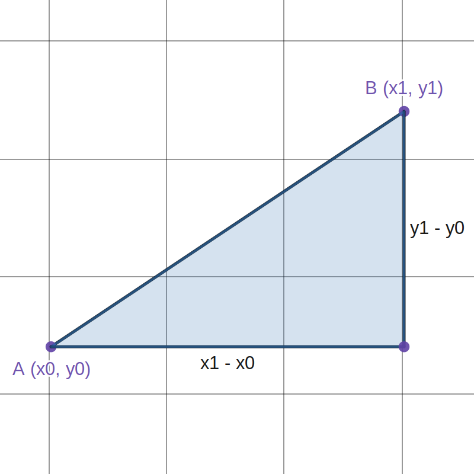
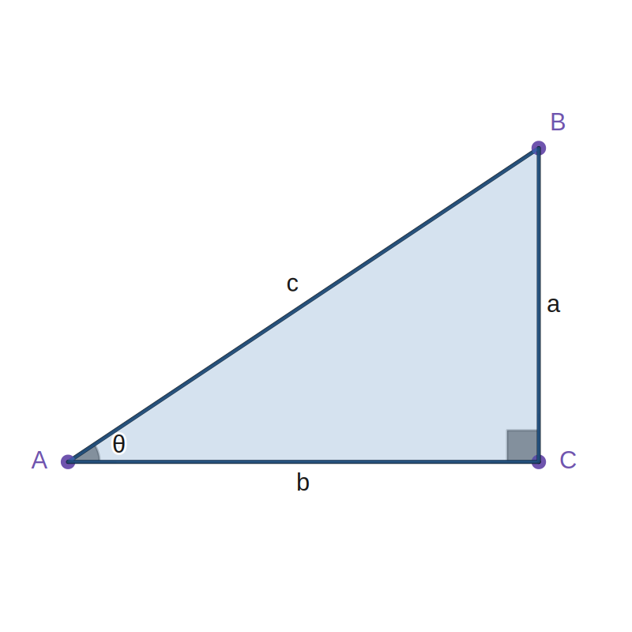
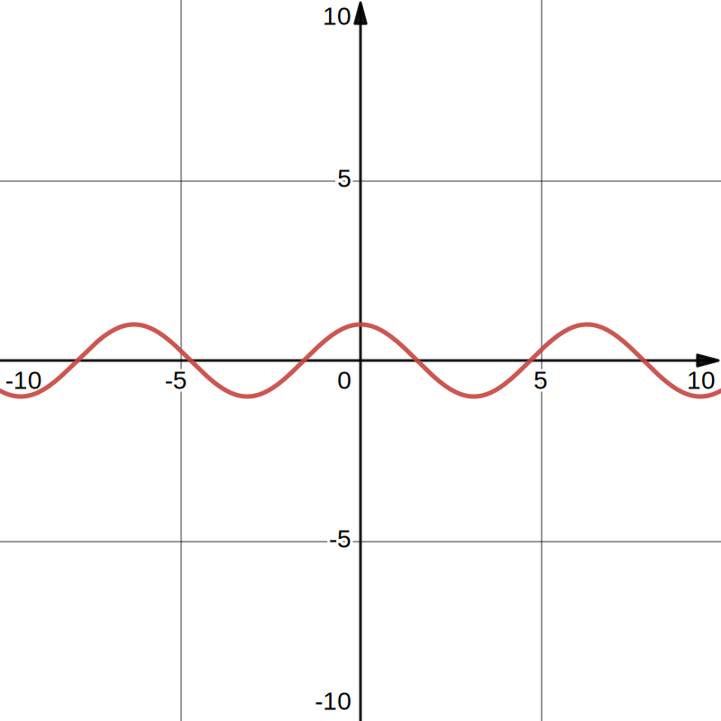
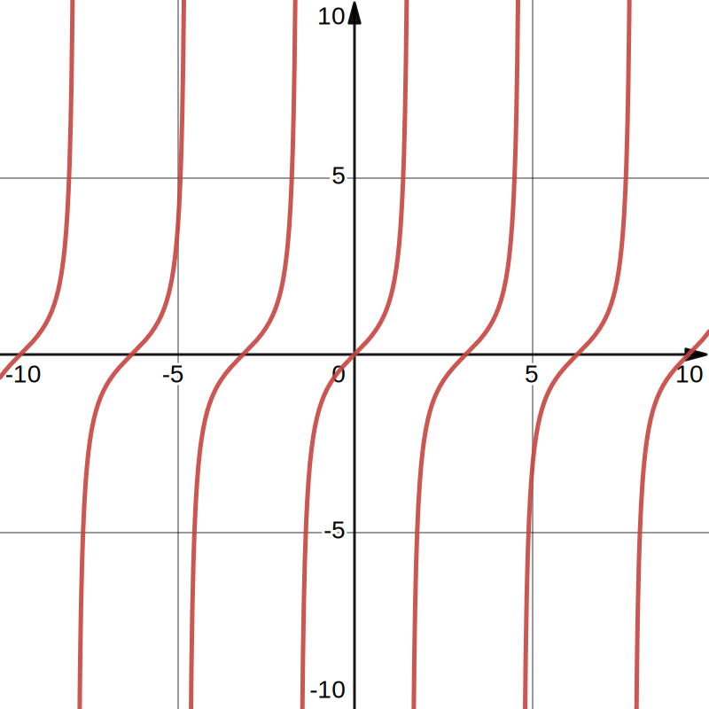
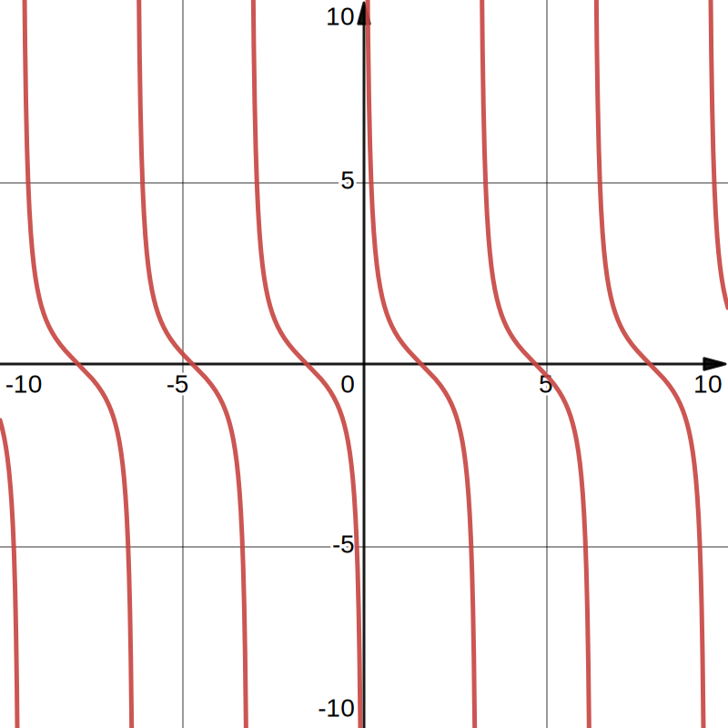
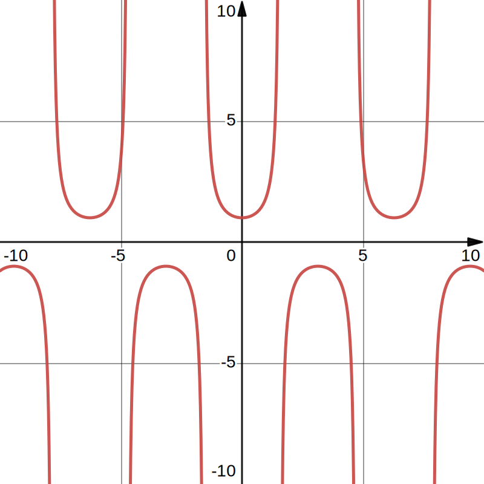
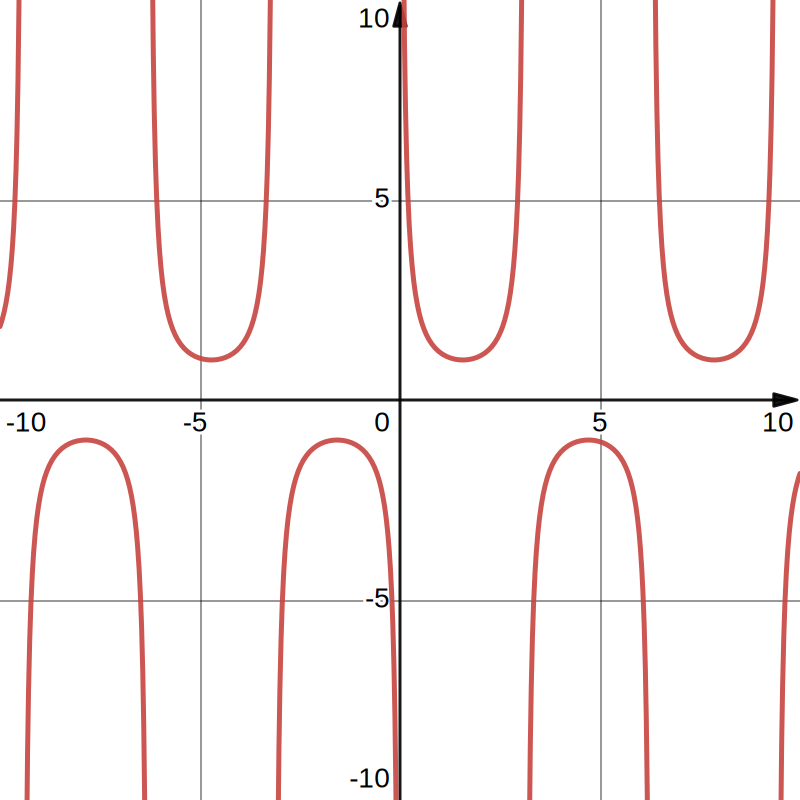
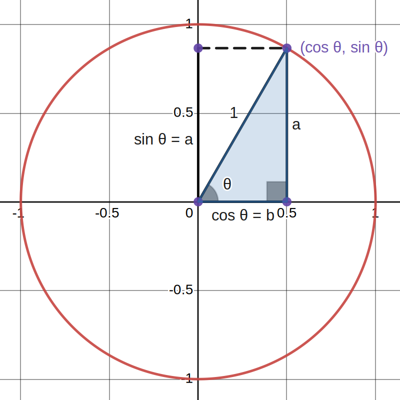
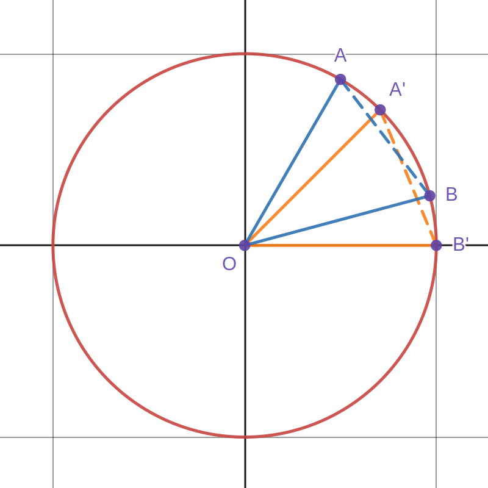

# Part.1 前置知识

## 1.1 任意角 & 弧度制

《人教版高中必修一》：

> 一条射线围绕其端点按逆时针方向旋转形成的角叫做正角，按顺时针方向旋转形成的角叫做负角.

> Tip：旋转可以不止一圈，所以任意角可以大于 $360\degree$.

## 1.2 

《人教版高中必修一》：

> 长度等于半径长的圆弧所对应的圆心角叫做 $1$ 弧度（Radian）的角，弧度单位用 $rad$ 表示，读作弧度.

圆周的长度和半径之比为 $2\pi$，所以  $360\degree=2\pi$，弧度和角度成正比，其他角度都可以通过换算得到：

| 角度制     | $15\degree$       | $30\degree$      | $45\degree$      | $60\degree$      | $90\degree$      | $120\degree$      | $180\degree$ | $270\degree$      | $360\degree$ |
| ---------- | ----------------- | ---------------- | ---------------- | ---------------- | ---------------- | ----------------- | ------------ | ----------------- | ------------ |
| **弧度制** | $\dfrac{\pi}{12}$ | $\dfrac{\pi}{6}$ | $\dfrac{\pi}{4}$ | $\dfrac{\pi}{3}$ | $\dfrac{\pi}{2}$ | $\dfrac{2\pi}{3}$ | $\pi$        | $\dfrac{3\pi}{2}$ | $2\pi$       |

> Tip：本文中所有的角度若无特殊说明，均为弧度制.

## 1.2 单位圆

> 单位圆指平面直角坐标系上，圆心为原点，半径为单位长度的圆.

单位圆的方程：$x^2+y^2=1$.

## 1.3 距离公式

> 设 $A$、$B$ 两点的坐标分别为 $A(x_0,y_0)$ 和 $B(x_1,y_1)$，则 $A$、$B$ 两点之间的距离 $dis=\sqrt{(x_0-x_1)^2+(y_0-y_1)^2}$.

- 推导：

构造直角三角形，不难发现两条直角边分别为 $(x_1-x_0)$ 和 $(y_1-y_0)$，而斜边就是 $A$ 点和 $B$ 点的距离 $dis$，根据勾股定理：

$dis^2=(x_0-x_1)^2+(y_0-y_1)^2$（相反数的平方相同，$(a-b)^2=(b-a)^2$ ）

所以 $dis=\sqrt{(x_0-x_1)^2+(y_0-y_1)^2}$.

> Tip：$A,B$ 两点间的距离一般用 $|AB|$ 表示.

# Part.2 锐角的三角函数

## 2.1 正弦函数（Sine）

- 定义：正弦等于对边和斜边的比.（$\sin{\theta}=\dfrac{a}{c}$）

- 定义域：$\mathbb{R}$

- 值域：$[-1,1]$

- 奇偶性：奇函数.

- 最小正周期：$2\pi$

- 导数：$(\sin{x})'=\cos{x}$

- 函数图像：

## 2.2 余弦函数（Cosine）

- 定义：余弦等于邻边和斜边的比.（$\tan{\theta}=\dfrac{b}{c}$）

- 定义域：$\mathbb{R}$

- 值域：$[-1,1]$

- 奇偶性：偶函数.

- 最小正周期：$2\pi$

- 导数：$(\cos{x})'=-\sin{x}$

- 函数图像：

## 2.3 正切函数（Tangent）

- 定义：正切等于对边和邻边的比.（$\tan{\theta}=\dfrac{a}{b}$）

- 定义域：$\{x|x\not=\dfrac{\pi}{2}+k\pi,k\in \mathbb{Z}\}$

- 值域：$\mathbb{R}$

- 奇偶性：奇函数.

- 最小正周期：$\pi$

- 导数：$(\tan{x})'=\sec^2{x}$

- 函数图像：

## 2.4 余切函数（Cotangent）

- 定义：余切等于邻边和对边的比.（$\cot{\theta}=\dfrac{b}{a}$）

- 定义域：$\{x|x\not=k\pi,k\in \mathbb{Z}\}$

- 值域：$\mathbb{R}$

- 奇偶性：奇函数.

- 最小正周期：$\pi$

- 导数：$(\cot{x})'=-\csc^2{x}$

- 函数图像：

## 2.5 正割函数（Secant）

- 定义：正割等于斜边和邻边的比.（$\sec{\theta}=\dfrac{c}{b}$）

- 定义域：$\{x|x\not=\dfrac{\pi}{2}+k\pi,k\in \mathbb{Z}\}$

- 值域：$\{y|y\le1 \or y\ge1\}$

- 奇偶性：偶函数.

- 最小正周期：$2\pi$

- 导数：$(\sec{x})'=\sec{x}\tan{x}$

- 函数图像：

## 2.6 余割函数（Cosecant）

- 定义：余割等于斜边和对边的比.（$\csc{\theta}=\dfrac{c}{a}$）

- 定义域：$\{x|x\not=k\pi,k\in \mathbb{Z}\}$

- 值域：$\{y|y\le1 \or y\ge1\}$

- 奇偶性：奇函数.

- 最小正周期：$2\pi$

- 导数：$(\csc{x})'=-\csc{x}\cot{x}$

- 函数图像：

> Tip：在中学阶段很少用到余切（$\cot$）、正割（$\sec$）、余割（$\csc$）.

# Part.3 任意角的三角函数

上文中的三角函数定义是基于直角三角形的，但直角三角形的锐角只能在 $(0,\dfrac{\pi}{2})$ 范围内

超出这个范围的三角函数就没有定义了，所以高中时会用单位圆推导出任意角的三角函数.

如图，把斜边为 $1$ 的三角形放入单位圆内.

观察发现，此时不管 $\theta$ 的大小，斜边 $c$ 永远等于 $1$，带入锐角三角函数的定义：

$\sin{\theta}=\dfrac{a}{c}=a$，$\cos{\theta}=\dfrac{b}{c}=b$

而 $a$ 和 $b$ 恰好是这个点的 **纵坐标** 和 **横坐标**.

所以是单位圆上角度为 $\theta$ 的点的纵坐标 $y=\sin{\theta}$，横坐标 $x=\cos{\theta}$.

> Tip：不要搞反，这个点坐标是 $(\cos{\theta},\sin{\theta})$，$\cos$ 在前面.

$\tan{\theta}=\dfrac{a}{b}=\dfrac{\sin{\theta}}{\cos{\theta}}=\dfrac{y}{x}$

不难发现 $\dfrac{y}{x}$ 就是计算直线斜率 $k$ 的公式.

所以一条直线的倾斜角为 $\theta$，则该直线的斜率 $k=\tan{\theta}$.

# Part.4 常用三角函数值表

| 角度           | $15\degree$                    | $$30\degree$$         | $45\degree$           | $60\degree$           | $90\degree$ | $120\degree$          | $150\degree$           | $180\degree$ | $270\degree$ | $360\degree$ |
| -------------- | ------------------------------ | --------------------- | --------------------- | --------------------- | ----------- | --------------------- | ---------------------- | ------------ | ------------ | ------------ |
| $\sin{\theta}$ | $\dfrac{\sqrt{6}-\sqrt{2}}{4}$ | $\dfrac{1}{2}$        | $\dfrac{\sqrt{2}}{2}$ | $\dfrac{\sqrt{3}}{2}$ | $1$         | $\dfrac{\sqrt{3}}{2}$ | $\dfrac{1}{2}$         | $0$          | $-1$         | $0$          |
| $\cos{\theta}$ | $\dfrac{\sqrt{6}+\sqrt{2}}{4}$ | $\dfrac{\sqrt{3}}{2}$ | $\dfrac{\sqrt{2}}{2}$ | $\dfrac{1}{2}$        | $0$         | $-\dfrac{1}{2}$       | $-\dfrac{\sqrt{3}}{2}$ | $-1$         | $0$          | $1$          |
| $\tan{\theta}$ | $2-\sqrt{3}$                   | $\dfrac{\sqrt{3}}{3}$ | $1$                   | $\sqrt{3}$            | $/$         | $-\sqrt{3}$           | $-\dfrac{\sqrt{3}}{3}$ | $0$          | $/$          | $0$          |

# Part.5 三角函数的关系

## 5.1 推导

### 平方关系推导

上图中蓝色三角形是直角三角形，根据勾股定理：

$\sin^2{\theta}+\cos^2{\theta}=1$

对于其他两个公式，我确信已发现了一种美妙的证法，可惜这里空白的地方太小，写不下.（费马行为）

$1+\tan^2{\alpha}=\sec^2{\alpha}$

$1+\cos^2{\alpha}=\csc^2{\alpha}$

### 其他三种关系推导

- 将三角函数的定义带入即可证明：

	$\begin{array}{l}
	  \sin{\theta}=\dfrac{a}{c} \\
	  \cos{\theta}=\dfrac{b}{c} \\
	  \tan{\theta}=\dfrac{a}{b} \\
	  \cot{\theta}=\dfrac{b}{a} \\
	  \sec{\theta}=\dfrac{c}{b} \\
	  \csc{\theta}=\dfrac{c}{a}
	\end{array}$

- 举例：$\tan{\alpha}=\dfrac{a}{b}=\dfrac{a/c}{b/c}=\dfrac{\sin{\alpha}}{\cos{\alpha}}$

## 5.2 平方关系

$\begin{array}{l}
  \sin^2{\alpha}+\cos^2{\alpha}=1 \\
  1+\tan^2{\alpha}=\sec^2{\alpha} \\
  1+\cos^2{\alpha}=\csc^2{\alpha}
\end{array}$

## 5.3 商数关系

$\begin{array}{l}
  \tan{\alpha}=\dfrac{\sin{\alpha}}{\cos{\alpha}} \\
  \cot{\alpha}=\dfrac{\cos{\alpha}}{\sin{\alpha}}
\end{array}$

## 5.4 倒数关系

$\begin{array}{l}
  \sin{\alpha}=\dfrac{1}{\csc{\alpha}} \\
  \cos{\alpha}=\dfrac{1}{\sec{\alpha}} \\
  \tan{\alpha}=\dfrac{1}{\cot{\alpha}}
\end{array}$

## 5.5 积的关系

$\begin{array}{l}
  \sin{\alpha}=\tan{\alpha}\cos{\alpha} \\
  \cos{\alpha}=\cot{\alpha}\sin{\alpha} \\
  \tan{\alpha}=\sin{\alpha}\sec{\alpha} \\
  \cot{\alpha}=\cos{\alpha}\csc{\alpha} \\
  \sec{\alpha}=\tan{\alpha}\csc{\alpha} \\
  \csc{\alpha}=\sec{\alpha}\cot{\alpha}
\end{array}$

# Part.6 三角函数的公式

## 6.1 两角和差公式

### 6.1.1 推导

#### 余弦差角公式推导

> Tip：这是唯一需要几何推导证明的公式，其他公式都是用另外的公式推出来的.

设 $\angle AOB'=\alpha$，$\angle BOB'=\beta$.

求出 $A$ 点和 $B$ 点的坐标分别为 $A(\cos{\alpha},\sin{\alpha})$ ，$B(\cos{\beta},\sin{\beta})$ .

则 $|AB|^2=(\cos{\alpha}-\cos{\beta})^2+(\sin{\alpha}-\sin{\beta})^2$.

让 $OA$ 和 $OB$ 同时顺时针旋转 $\beta$，得到 $OA'$ 和 $OB'$.

此时 $OB$ 和 $x$ 轴重合.

不难证明 $\triangle ABO\cong\triangle A'B'O$，所以 $|AB|=|A'B'|$，$|AB|^2=|A'B'|^2$.

$\angle A'OB'=\alpha-\beta$，所以 $A'$ 点的坐标为 $A'(\cos{(\alpha-\beta)},\sin{(\alpha-\beta)})$，$B'$ 点的坐标为 $B'(1,0)$.

则 $|A'B'|^2=(\cos{(\alpha-\beta)}-1)^2+(\sin{(\alpha-\beta)}-0)^2$

$\begin{aligned}
  {} |AB|^2 &= (\cos{\alpha}-\cos{\beta})^2+(\sin{\alpha}-\sin{\beta})^2 \\
  &= \cos^2{\alpha}-2\cos{\alpha}\cos{\beta}+\cos^2{\beta}+sin^2{\alpha}-2\sin{\alpha}\sin{\beta}+sin^2{\beta} \\
  &= 2-2(\cos{\alpha}\cos{\beta}+\sin{\alpha}\sin{\beta})
\end{aligned}$

$\begin{aligned}
  {} |A'B'|^2 &= (\cos{(\alpha-\beta)}-1)^2+(\sin{(\alpha-\beta)}-0)^2 \\
  &= \cos^2{\alpha-\beta}-2\cos{\alpha-\beta}+1+\sin^2{\alpha+\beta} \\
  &= 2-2\cos{(\alpha-\beta)}
\end{aligned}$

因为 $|AB|^2=|A'B'|^2$，所以 $\cos{(\alpha-\beta)}=\cos{\alpha}\cos{\beta}+\sin{\alpha}\sin{\beta}$.

#### 余弦和角公式推导

$\begin{aligned}
  {} \cos{(\alpha+\beta)}= &= \cos{(\alpha-(-\beta))} \\
  &= \cos{\alpha}\cos{(-\beta)}+\sin{\alpha}\sin{(-\beta)} \\
  &= \cos{\alpha}\cos{\beta}-\sin{\alpha}\sin{\beta}
\end{aligned}$

#### 正弦差角公式推导

$\cos{(\dfrac{\pi}{2}-\theta)}=\cos{\dfrac{\pi}{2}}\cos{\theta}+\sin{\dfrac{\pi}{2}}\sin{\theta}=\sin{\theta}$

$\sin{(\dfrac{\pi}{2}-\theta)}=\cos{(\dfrac{\pi}{2}-(\dfrac{\pi}{2}-\theta))}=\cos{\theta}$

$\begin{aligned}
  {} \sin{(\alpha-\beta)} &= \cos{(\dfrac{\pi}{2}-(\alpha-\beta))} \\
  &= \cos{((\dfrac{\pi}{2}-\alpha)+\beta)} \\
  &= \cos{(\dfrac{\pi}{2}-\alpha)}\cos{\beta}-\sin{(\dfrac{\pi}{2}-\alpha)}\sin{\beta} \\
  &= \sin{\alpha}\cos{\beta}-\cos{\alpha}\sin{\beta}
\end{aligned}$

#### 正弦和角公式推导

$\begin{aligned}
  {} \sin{(\alpha+\beta)}= &= \sin{(\alpha-(-\beta))} \\
  &= \sin{\alpha}\cos{(-\beta)}+\cos{\alpha}\sin{(-\beta)} \\
  &= \sin{\alpha}\cos{\beta}+\cos{\alpha}\sin{\beta}
\end{aligned}$

#### 正切差角公式推导

$\begin{aligned}
  {} \tan{\alpha-\beta} &= \dfrac{\sin{(\alpha-\beta)}}{\cos{(\alpha-\beta)}} \\
  &= \dfrac{\sin{\alpha}\cos{\beta}-\cos{\alpha}\sin{\beta}}{\cos{\alpha}\cos{\beta}+\sin{\alpha}\sin{\beta}} \\
  &= \dfrac{\tan{\alpha}-\tan{\beta}}{1+\tan{\alpha}\tan{\beta}}
\end{aligned}$

#### 正切和角公式推导

$\begin{aligned}
  {} \tan{(\alpha+\beta)} &= \tan{(\alpha-(-\beta))} \\
  &= \dfrac{\tan{\alpha}-\tan{(-\beta)}}{1+\tan{\alpha}\tan{(-\beta})} \\
  &= \dfrac{\tan{\alpha}+\tan{\beta}}{1-\tan{\alpha}\tan{\beta}}
\end{aligned}$

### 6.1.2 公式

$\begin{array}{l}
  \sin{(\alpha+\beta)}=\sin{\alpha}\cos{\beta}+\cos{\alpha}\sin{\beta} \\
  \sin{(\alpha-\beta)}=\sin{\alpha}\cos{\beta}-\cos{\alpha}\sin{\beta} \\
  \cos{(\alpha+\beta)}=\cos{\alpha}\cos{\beta}-\sin{\alpha}\sin{\beta} \\
  \cos{(\alpha-\beta)}=\cos{\alpha}\cos{\beta}+\sin{\alpha}\sin{\beta} \\
  \tan{(\alpha+\beta)}=\dfrac{\tan{\alpha}+\tan{\beta}}{1-\tan{\alpha}\tan{\beta}} \\
  \tan{(\alpha-\beta)}=\dfrac{\tan{\alpha}-\tan{\beta}}{1+\tan{\alpha}\tan{\beta}}
\end{array}$

## 6.2 诱导公式

### 6.2.1 推导

- 诱导公式用和差角公式计算即可.

### 6.2.2 记忆

- 口诀：奇变偶不变，符号看象限.

	1. 奇变偶不变：奇偶指 $\dfrac{\pi}{2}$ 的系数，比如 $\pi,2\pi$ 是偶数，$\dfrac{\pi}{2},\dfrac{3\pi}{2}$ 是奇数.

	如果是偶数，前后函数名一致；如果是奇数，改变函数名.（将 $\sin$ 变成 $\cos$，$\cos$ 变成 $\sin$，$\tan$ 变成 $\cot$，$\cot$ 变成 $\tan$）

	2. 符号看象限：把 $\alpha$ 看作第一象限角，计算出前面的值在后面函数的正负（$k\in\mathbb{Z}$）：

|      符号      |              第一象限               |                第二象限                 |                 第三象限                 |                 第四象限                  |
| :------------: | :---------------------------------: | :-------------------------------------: | :--------------------------------------: | :---------------------------------------: |
|      范围      | $2k\pi<\alpha<2k\pi+\dfrac{\pi}{2}$ | $2k\pi+\dfrac{\pi}{2}<\alpha<2k\pi+\pi$ | $2k\pi+\pi<\alpha<2k\pi+\dfrac{3\pi}{2}$ | $2k\pi+\dfrac{3\pi}{2}<\alpha<2k\pi+2\pi$ |
| $\sin{\alpha}$ |                 $+$                 |                   $+$                   |                   $-$                    |                    $-$                    |
| $\cos{\alpha}$ |                 $+$                 |                   $-$                   |                   $-$                    |                    $+$                    |
| $\tan{\alpha}$ |                 $+$                 |                   $-$                   |                   $+$                    |                    $-$                    |
| $\cot{\alpha}$ |                 $+$                 |                   $-$                   |                   $+$                    |                    $-$                    |

- 举例：求 $\sin{(\dfrac{3\pi}{2}-\alpha)}$.

	1. $\dfrac{3\pi}{2}=3\cdot\dfrac{\pi}{2}$，$3$ 是奇数，要将 $\sin$ 变成 $\cos$.
	2. 把 $\alpha$ 看作第一象限角，则 $(\dfrac{3\pi}{2}-\alpha)$ 为第三象限角，$\cos$ 在第三象限为负数，所以是负号.
	3. 得 $\sin{(\dfrac{3\pi}{2}-\alpha)}=-\cos{\alpha}$.

### 6.2.3 公式

#### 第一组诱导公式

$\begin{array}{l}
  \sin{(\dfrac{\pi}{2}+\alpha)}=\cos{\alpha} \\
  \sin{(\dfrac{\pi}{2}-\alpha)}=\cos{\alpha} \\
  \cos{(\dfrac{\pi}{2}+\alpha)}=-\sin{\alpha} \\
  \cos{(\dfrac{\pi}{2}-\alpha)}=\sin{\alpha}
\end{array}$

#### 第二组诱导公式

$\begin{array}{l}
  \sin{(\pi+\alpha)}=-\sin{\alpha} \\
  \sin{(\pi-\alpha)}=\sin{\alpha} \\
  \cos{(\pi+\alpha)}=-\cos{\alpha} \\
  \cos{(\pi-\alpha)}=-\cos{\alpha}
\end{array}$

#### 第三组诱导公式

$\begin{array}{l}
  \sin{(\dfrac{3\pi}{2}+\alpha)}=-\cos{\alpha} \\
  \sin{(\dfrac{3\pi}{2}-\alpha)}=-\cos{\alpha} \\
  \cos{(\dfrac{3\pi}{2}+\alpha)}=\sin{\alpha} \\
  \cos{(\dfrac{3\pi}{2}-\alpha)}=-\sin{\alpha}
\end{array}$

#### 第四组诱导公式

$\begin{array}{l}
  \sin{(2\pi+\alpha)}=\sin{\alpha} \\
  \sin{(2\pi-\alpha)}=-\sin{\alpha} \\
  \cos{(2\pi+\alpha)}=\cos{\alpha} \\
  \cos{(2\pi-\alpha)}=\cos{\alpha}
\end{array}$

## 6.3 二倍角公式

### 6.3.1 推导

#### 余弦二倍角公式推导

$\begin{aligned}
  {} \cos{2\alpha} &= \cos{(\alpha+\alpha)} \\
  &= \cos{\alpha}\cos{\alpha}-\sin{\alpha}\sin{\alpha} \\
  &= \cos^2{\alpha}-\sin^2{\alpha} \\
  &= 1-2\sin^2{\alpha} \\
  &= 2\cos^2{\alpha}-1
\end{aligned}$

- 以上三个公式等价.

#### 正弦二倍角公式推导

$\begin{aligned}
  {} \sin{2\alpha} &= \sin{(\alpha+\alpha)} \\
  &= \sin{\alpha}\cos{\alpha}+\cos{\alpha}\sin{\alpha} \\
  &= 2\sin{\alpha}\cos{\alpha}
\end{aligned}$

#### 正切二倍角公式推导

$\begin{aligned}
  {} \tan{2\alpha} &= \dfrac{\sin{2\alpha}}{\cos{2\alpha}} \\
  &= \dfrac{2\sin{\alpha}\cos{\alpha}}{\cos^2{\alpha}-\sin^2{\alpha}} \\
  &= \dfrac{2\sin{\alpha}\cos{\alpha}}{\cos^2{\alpha}-\sin^2{\alpha}} \\
  &= \dfrac{2\sin{\alpha}\cos{\alpha}/\cos^2{\alpha}}{\cos^2{\alpha}/\cos^2{\alpha}-  \sin^2{\alpha}/\cos^2{\alpha}} \\
  &= \dfrac{2\tan{\alpha}}{1-\tan^2{\alpha}}
\end{aligned}$

### 6.3.2 公式

$\begin{array}{l}
  \sin{2\alpha}=2\sin{\alpha}\cos{\alpha} \\
  \cos{2\alpha}=\cos^2{\alpha}-\sin^2{\alpha}=1-2\sin^2{\alpha}=2\cos^2{\alpha}-1 \\
  \tan{2\alpha}=\dfrac{2\tan{\alpha}}{1-\tan^2{\alpha}}
\end{array}$

## 6.4 三倍角公式

### 6.4.1推导

#### 正弦三倍角公式推导

$\begin{aligned}
  {} \sin{3\alpha} &= \sin{(2\alpha+\alpha)} \\
  &= \sin{2\alpha}\cos{\alpha}+\cos{2\alpha}\sin{\alpha} \\
  &= 2\sin{\alpha}(1-\sin^2{\alpha})+(1-2\sin^2{\alpha})\sin{\alpha} \\
  &= 3\sin{\alpha}-4\sin^3{\alpha}
\end{aligned}$

#### 余弦三倍角公式推导

$\begin{aligned}
  {} \cos{3\alpha} &= \cos{(2\alpha+\alpha)} \\
  &= \cos{2\alpha}\cos{\alpha}-\sin{2\alpha}\sin{\alpha} \\
  &= (2\cos^2{\alpha}-1)\cos{\alpha}-2(1-\cos^2{\alpha})\cos{\alpha} \\
  &= 4\cos^3{\alpha}-3\cos{\alpha}
\end{aligned}$

#### 正切三倍角公式推导

$\begin{aligned}
  {} \tan{3\alpha} &= \dfrac{\sin{3\alpha}}{\cos{3\alpha}} \\
  &= \dfrac{3\sin{\alpha}-4\sin^3{\alpha}}{4\cos^3{\alpha}-3\cos{\alpha}} \\
  &= \dfrac{4\sin{\alpha}\sin{(\dfrac{\pi}{3}+\alpha)}\sin{(\dfrac{\pi}{3}-\alpha)}}{4\cos{\alpha}\cos{(\dfrac{\pi}{3}-\alpha)}\cos{(\dfrac{\pi}{3}+\alpha)}} \\
  &= \tan{\alpha}\tan{(\dfrac{\pi}{3}-\alpha)}\tan{(\dfrac{\pi}{3}+\alpha)}
\end{aligned}$

### 6.4.2 公式

$\begin{array}{l}
  \sin{3\alpha}=3\sin{\alpha}-4\sin^3{\alpha} \\
  \cos{3\alpha}=-3\cos{\alpha}+4\cos^3{\alpha} \\
  \tan{3\alpha}=\tan{\alpha}\tan{(\dfrac{\pi}{3}-\alpha)}\tan{(\dfrac{\pi}{3}+\alpha)}
\end{array}$

## 6.5 半角公式

### 6.5.1 推导

#### 余弦半角公式推导

$\cos{2\theta}=2\cos^2{\theta}-1$

令 $\alpha=2\theta$.

$\begin{array}{l}
  \cos{\alpha}=2\cos^2{\dfrac{\alpha}{2}}-1 \\
  \Rightarrow \cos^2{\dfrac{\alpha}{2}}=\dfrac{1+\cos{\alpha}}{2} \\
  \Rightarrow \cos{\dfrac{\alpha}{2}}=\pm\sqrt{\dfrac{1+\cos{\alpha}}{2}}
\end{array}$

#### 正弦半角公式推导

$\cos{2\theta}=1-2\sin^2{\theta}$

令 $\alpha=2\theta$.

$\begin{array}{l}
  \cos{\alpha}=1-2\sin^2{\dfrac{\alpha}{2}} \\
  \Rightarrow \sin^2{\dfrac{\alpha}{2}}=\dfrac{1-\cos{\alpha}}{2} \\
  \Rightarrow \sin{\dfrac{\alpha}{2}}=\pm\sqrt{\dfrac{1-\cos{\alpha}}{2}}
\end{array}$

#### 正切半角公式推导

$\begin{aligned}
  {} \tan{\dfrac{\alpha}{2}} &= \dfrac{\sin{\dfrac{\alpha}{2}}}{\cos{\dfrac{\alpha}{2}}} \\
  &= \dfrac{\pm\sqrt{\dfrac{1-\cos{\alpha}}{2}}}{\pm\sqrt{\dfrac{1+\cos{\alpha}}{2}}} \\
  &= \pm\sqrt{\dfrac{1-\cos{\alpha}}{1+\cos{\alpha}}}
\end{aligned}$

$\begin{aligned}
  {} \tan{\dfrac{\alpha}{2}} &= \dfrac{\sin{\dfrac{\alpha}{2}}}{\cos{\dfrac{\alpha}{2}}} \\
  &= \dfrac{\sin{\dfrac{\alpha}{2}}\cdot2\cos{\dfrac{\alpha}{2}}}{\cos{\dfrac{\alpha}{2}}\cdot2\cos{\dfrac{\alpha}{2}}} \\
  &= \dfrac{2\sin{\dfrac{\alpha}{2}}\cos{\dfrac{\alpha}{2}}}{2\cos^2{\dfrac{\alpha}{2}}} \\
  &= \dfrac{\sin{\alpha}}{1+\cos{\alpha}}
\end{aligned}$

$\begin{aligned}
  {} \tan{\dfrac{\alpha}{2}} &= \dfrac{\sin{\dfrac{\alpha}{2}}}{\cos{\dfrac{\alpha}{2}}} \\
  &= \dfrac{\sin{\dfrac{\alpha}{2}}\cdot2\sin{\dfrac{\alpha}{2}}}{\cos{\dfrac{\alpha}{2}}\cdot2\sin{\dfrac{\alpha}{2}}} \\
  &= \dfrac{2\sin^2{\dfrac{\alpha}{2}}}{2\sin{\dfrac{\alpha}{2}}\cos{\dfrac{\alpha}{2}}} \\
  &= \dfrac{1-\cos{\alpha}}{\sin{\alpha}}
\end{aligned}$

- 以上三个公式等价.

### 6.5.2 公式

$\begin{array}{l}
  \sin{\dfrac{\alpha}{2}}=\pm\sqrt{\dfrac{1-\cos{\alpha}}{2}} \\
  \cos{\dfrac{\alpha}{2}}=\pm\sqrt{\dfrac{1+\cos{\alpha}}{2}} \\
  \tan{\dfrac{\alpha}{2}}=\pm\sqrt{\dfrac{1-\cos{\alpha}}{1+\cos{\alpha}}}=\dfrac{\sin{\alpha}}{1+\cos{\alpha}}=\dfrac{1-\cos{\alpha}}{\sin{\alpha}}
\end{array}$

## 6.6 积化和差公式

### 6.6.1推导

正弦两角和差公式：

$\sin{(\alpha+\beta)}=\sin{\alpha}\cos{\beta}+\cos{\alpha}\sin{\beta}$

$\sin{(\alpha-\beta)}=\sin{\alpha}\cos{\beta}-\cos{\alpha}\sin{\beta}$

令 $\sin{\alpha}\cos{\beta}=x$，$\cos{\alpha}\sin{\beta}=y$.

已知 $x,y$ 的和为 $\sin{(\alpha+\beta)}$，差为 $\sin{(\alpha-\beta)}$，求 $x,y$.

就是小学二年级学过的和差问题：

$x=(\text{和}+\text{差})/2$，$y=(\text{和}-\text{差})/2$

$x=\sin{\alpha}\cos{\beta}=\dfrac{1}{2}[\sin{(\alpha+\beta)}+\sin{(\alpha-\beta)}]$

$y=\cos{\alpha}\sin{\beta}=\dfrac{1}{2}[\sin{(\alpha+\beta)}-\sin{(\alpha-\beta)}]$

同理，用余弦两角和差公式，可以求出另外两组积化和差公式：

$\cos{(\alpha+\beta)}=\cos{\alpha}\cos{\beta}-\sin{\alpha}\sin{\beta}$

$\cos{(\alpha-\beta)}=\cos{\alpha}\cos{\beta}+\sin{\alpha}\sin{\beta}$

$\cos{\alpha}\cos{\beta}=\dfrac{1}{2}[\cos{(\alpha+\beta)}+\cos{(\alpha-\beta)}]$

$\sin{\alpha}\sin{\beta}=-\dfrac{1}{2}[\cos{(\alpha+\beta)}-\cos{(\alpha-\beta)}]$

### 6.6.2 记忆

$\begin{array}{l}
  sc=\dfrac{1}{2}(s+s) \\
  cs=\dfrac{1}{2}(s-s) \\
  cc=\dfrac{1}{2}(c+c) \\
  ss=-\dfrac{1}{2}(c-c)
\end{array}$

### 6.6.3 公式

$\begin{array}{l}
  \sin{\alpha}\cos{\beta}=\dfrac{1}{2}[\sin{(\alpha+\beta)}+\sin{(\alpha-\beta)}] \\
  \cos{\alpha}\sin{\beta}=\dfrac{1}{2}[\sin{(\alpha+\beta)}-\sin{(\alpha-\beta)}] \\
  \cos{\alpha}\cos{\beta}=\dfrac{1}{2}[\cos{(\alpha+\beta)}+\cos{(\alpha-\beta)}] \\
  \sin{\alpha}\sin{\beta}=-\dfrac{1}{2}[\cos{(\alpha+\beta)}-\cos{(\alpha-\beta)}]
\end{array}$

## 6.7 和差化积公式

### 6.7.1 推导

- 积化和差公式：

$\begin{array}{l}
  \sin{\alpha}\cos{\beta}=\dfrac{1}{2}[\sin{(\alpha+\beta)}+\sin{(\alpha-\beta)}] \\
  \cos{\alpha}\sin{\beta}=\dfrac{1}{2}[\sin{(\alpha+\beta)}-\sin{(\alpha-\beta)}] \\
  \cos{\alpha}\cos{\beta}=\dfrac{1}{2}[\cos{(\alpha+\beta)}+\cos{(\alpha-\beta)}] \\
  \sin{\alpha}\sin{\beta}=-\dfrac{1}{2}[\cos{(\alpha+\beta)}-\cos{(\alpha-\beta)}]
\end{array}$

令 $\alpha+\beta=A$，$\alpha-\beta=B$.

则 $\alpha=\dfrac{A+B}{2}$，$\beta=\dfrac{A-B}{2}$.

- 带入积化和差公式：

$\begin{array}{l}
  \sin{\dfrac{A+B}{2}}\cos{\dfrac{A-B}{2}}=\dfrac{1}{2}[\sin{A}+\sin{B}] \\
  \cos{\dfrac{A+B}{2}}\sin{\dfrac{A-B}{2}}=\dfrac{1}{2}[\sin{A}-\sin{B}] \\
  \cos{\dfrac{A+B}{2}}\cos{\dfrac{A-B}{2}}=\dfrac{1}{2}[\cos{A}+\cos{B}] \\
  \sin{\dfrac{A+B}{2}}\sin{\dfrac{A-B}{2}}=-\dfrac{1}{2}[\cos{A}-\cos{B}]
\end{array}$

移项得：

$\begin{array}{l}
  \sin{A}+\sin{B}=2\sin{\dfrac{A+B}{2}}\cos{\dfrac{A-B}{2}} \\
  \sin{A}-\sin{B}=2\cos{\dfrac{A+B}{2}}\sin{\dfrac{A-B}{2}} \\
  \cos{A}+\cos{B}=2\cos{\dfrac{A+B}{2}}\cos{\dfrac{A-B}{2}} \\
  \cos{A}-\cos{B}=-2\sin{\dfrac{A+B}{2}}\sin{\dfrac{A-B}{2}}
\end{array}$

### 6.7.2 公式

$\begin{array}{l}
  \sin{\alpha}+\sin{\beta}=2\sin{\dfrac{\alpha+\beta}{2}}\cos{\dfrac{\alpha-\beta}{2}} \\
  \sin{\alpha}-\sin{\beta}=2\cos{\dfrac{\alpha+\beta}{2}}\sin{\dfrac{\alpha-\beta}{2}} \\
  \cos{\alpha}+\cos{\beta}=2\cos{\dfrac{\alpha+\beta}{2}}\cos{\dfrac{\alpha-\beta}{2}} \\
  \cos{\alpha}-\cos{\beta}=-2\sin{\dfrac{\alpha+\beta}{2}}\sin{\dfrac{\alpha-\beta}{2}}
\end{array}$

## 6.8 辅助角公式

### 6.8.1 推导

$\begin{aligned}
  {} a\sin{\theta}+b\cos{\theta} &= \sqrt{a^2+b^2}(\dfrac{a}{\sqrt{a^2+b^2}}\sin{\theta}+\dfrac{b}{\sqrt{a^2+b^2}}\cos{\theta}) \\
  &= \sqrt{a^2+b^2}(\cos{\varphi}\sin{\theta}+\sin{\varphi}\cos{\theta}) \\
  &= \sqrt{a^2+b^2}\sin{(\theta+\varphi)}
\end{aligned}$

第二步到第三步，$\dfrac{a}{\sqrt{a^2+b^2}}$ 和 $\dfrac{b}{\sqrt{a^2+b^2}}$ 的平方和等于 $1$，而 $\cos{\varphi}$ 和 $\sin{\varphi}$ 的平方和也等于 $1$，所以可以换元.

同理，可以将 $\cos{\varphi}$ 和 $\sin{\varphi}$ 交换位置.

$\begin{aligned}
  {} a\sin{\theta}+b\cos{\theta} &= \sqrt{a^2+b^2}(\dfrac{a}{\sqrt{a^2+b^2}}\sin{\theta}+\dfrac{b}{\sqrt{a^2+b^2}}\cos{\theta}) \\
  &= \sqrt{a^2+b^2}(\sin{\varphi}\sin{\theta}+\cos{\varphi}\cos{\theta}) \\
  &= \sqrt{a^2+b^2}\cos{(\theta-\varphi)}
\end{aligned}$

### 6.8.2 公式

$\begin{array}{l}
  a\sin{\theta}+b\cos{\theta}=\sqrt{a^2+b^2}\sin{(\theta+\varphi)},\tan{\varphi}=\dfrac{b}{a} \\
  a\sin{\theta}+b\cos{\theta}=\sqrt{a^2+b^2}\cos{(\theta-\varphi)},\tan{\varphi}=\dfrac{a}{b}
\end{array}$

## 6.9 万能公式

### 6.9.1 推导

#### 正弦万能公式推导

$\begin{aligned}
  {} \sin{\alpha} &= \sin{(\dfrac{\alpha}{2}+\dfrac{\alpha}{2})} \\
  &= 2\sin{\dfrac{\alpha}{2}}\cos{\dfrac{\alpha}{2}} \\
  &= \dfrac{2\sin{\dfrac{\alpha}{2}}\cos{\dfrac{\alpha}{2}}}{\cos^2{\dfrac{\alpha}{2}}+\sin^2{\dfrac{\alpha}{2}}} \\
  &= \dfrac{2\tan{\dfrac{\alpha}{2}}}{1+\tan^2{\dfrac{\alpha}{2}}}
\end{aligned}$

#### 余弦万能公式推导

$\begin{aligned}
  {} \cos{\alpha} &= \cos{(\dfrac{\alpha}{2}+\dfrac{\alpha}{2})} \\
  &= \cos^2{\dfrac{\alpha}{2}}-\sin^2{\dfrac{\alpha}{2}} \\
  &= \dfrac{\cos^2{\dfrac{\alpha}{2}}-\sin^2{\dfrac{\alpha}{2}}}{\cos^2{\dfrac{\alpha}{2}}+\sin^2{\dfrac{\alpha}{2}}} \\
  &= \dfrac{1-\tan^2{\dfrac{\alpha}{2}}}{1+\tan^2{\dfrac{\alpha}{2}}}
\end{aligned}$

#### 正切万能公式推导

$\tan{\alpha}=\dfrac{\sin{\alpha}}{\cos{\alpha}}=\dfrac{2\tan{\dfrac{\alpha}{2}}}{1-\tan^2{\dfrac{\alpha}{2}}}$

### 6.9.2 公式

$\begin{array}{l}
  \sin{\alpha}=\dfrac{2\tan{\dfrac{\alpha}{2}}}{1+\tan^2{\dfrac{\alpha}{2}}} \\
  \cos{\alpha}=\dfrac{1-\tan^2{\dfrac{\alpha}{2}}}{1+\tan^2{\dfrac{\alpha}{2}}} \\
  \tan{\alpha}=\dfrac{2\tan{\dfrac{\alpha}{2}}}{1-\tan^2{\dfrac{\alpha}{2}}}
\end{array}$

# Part.7 拓展内容

> Tip：7.1 章是高中物理内容，~~作者不会~~ 与本文无关；7.2、7.3、7.4、7.5 章节高中不学，可以根据视频自行了解.

## 7.1 简谐运动

$x=A\cos{(\omega t+\varphi)}$

- [地球打穿一个洞，人跳进去会发生什么？李永乐老师讲简谐运动](https://www.bilibili.com/video/BV1Nb411g76W)

## 7.2 三角函数和复数

$e^{i\theta}=\cos{\theta}+i\sin{\theta}$

- [【官方双语】微分方程概论-第五章：在3.14分钟内理解e^iπ](https://www.bilibili.com/video/BV1G4411D7kZ)
- [用几何直觉理解欧拉公式！【中学生也能懂|manim】](https://www.bilibili.com/video/BV1bF411P7RL)

## 7.3 反三角函数

《百度百科》反三角函数：

> 三角函数的反函数是个多值函数，因为它并不满足一个自变量对应一个函数值的要求，其图像与其原函数关于函数 y=x 对称。欧拉提出反三角函数的概念，并且首先使用了“arc+函数名”的形式表示反三角函数.

- [这个视频可能颠覆你对反三角函数的认识！](https://www.bilibili.com/video/BV1oC4y1G7Zk/)

## 7.4 双曲函数

$e^{j\theta}=\cosh{\theta}+j\sinh{\theta}$

- [双曲函数——带你领略课本上没有的神奇函数！](https://www.bilibili.com/video/BV1xp4y1v7cw)
- [双曲正弦，余弦是如何得到的？有和正弦余弦有什么关系？|manim](https://www.bilibili.com/video/BV1RV411o7sY)

## 7.5 傅里叶变换

$F(\omega)=\displaystyle\int_{-\infty}^{\infty}f(x)e^{-i\omega x}dx$

- [【官方双语】形象展示傅里叶变换](https://www.bilibili.com/video/BV1pW411J7s8)
- [这个算法改变了世界](https://www.bilibili.com/video/BV1CY411R7bA)