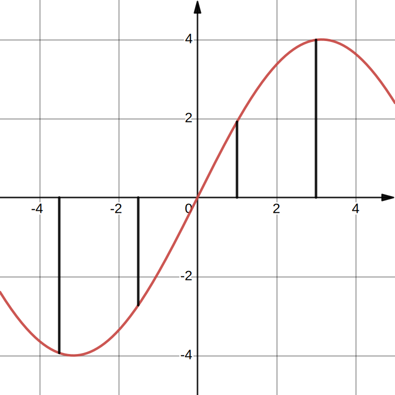
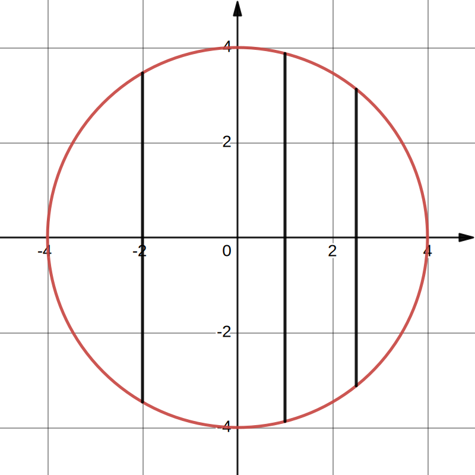
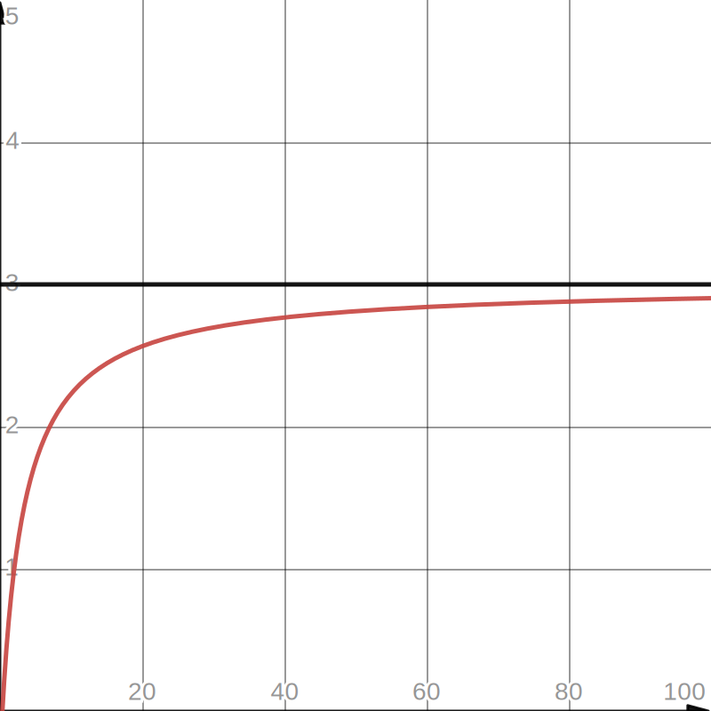
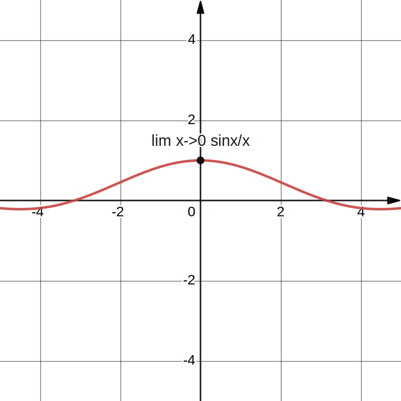
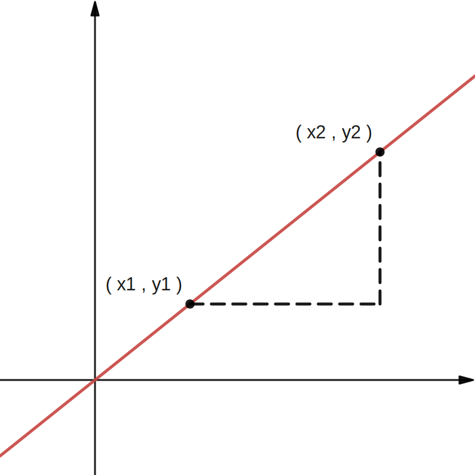

# Part.0 关于本文

## 0.1 信息

- 作者：lailai0916

- QQ：11548585

- UPD：2023/10/11

## 0.2 说明

本文中，若无特殊说明，用 $f(x)$ 表示函数，且保证 $f(x)$ 在定义域内处处可导.

图片中，${\color{Red}{\text{红色}}}$ 的图像是讨论的函数，其他颜色是辅助线等.

> Tips：为防止歧义，本文中出现的全角句号（ ${\color{Orange}{\text{。}}}$）均使用半角逗号（ ${\color{Orange}{\text{.}}}$ ）代替.

# Part.1 前置知识

## 1.1 阶乘（Factorial）

《百度百科》阶乘：

> 一个正整数的阶乘（factorial）是所有小于及等于该数的正整数的积，并且 $0$ 的阶乘为 $1$. 自然数 $n$ 的阶乘写作 $n!$.

例如：$3!=3 \times 2 \times 1=6$；$5!=5 \times 4 \times 3 \times 2 \times 1=120$.

## 1.2 增量（Increment）

增量指的是在一段时间内，自变量取不同的值所对应的 ${\color{Orange}{\text{函数值之差}}}$.

一个变量或函数的增量一般 ${\color{Orange}{\text{在前面加}\Delta\text{表示}}}$.

例如：$x$ 的增量写作 $\Delta x$；$f(x)$ 的增量写作 $\Delta f(x)$.

## 1.3 函数（Function）

《人教版高中数学必修一》：

> 一般地，设 $\mathbb{A}, \mathbb{B}$ 是非空的实数集，如果对于集合 $\mathbb{A}$ 中的任意一个数 $x$，按照某种确定的对应关系 $f$，在集合 $\mathbb{B}$ 中都有唯一确定的数 $y$ 和它对应，那么就称 $f:\mathbb{A} \to \mathbb{B}$ 为从集合 $\mathbb{A}$ 到集合 $\mathbb{B}$ 的一个函数（function），记作 $y=f(x), x \in \mathbb{A}$.

解释：一个 $x$ 对应 ${\color{Orange}{\text{唯一的}}}$ $f(x)$.

> Tips：表示函数，初中一般用 $y$，高中一般用 $f(x)$.

${\color{Orange}{\text{是函数}}}$：一个 $x$（黑线）对应一个 $f(x)$.

${\color{Orange}{\text{不是函数}}}$：一个 $x$（黑线）对应多个 $f(x)$.

# Part.2 极限（Limit）

《微积分》：

> 略.

解释：当 $x$ 趋近于 $x_0$ 时，$f(x)$ 会无限趋近于一个 ${\color{Orange}{\text{确定的值}}}$，这个值就是函数 $f(x)$ 在 $x_0$ 处的极限.

## 2.1 例子

### 例1. 求 $\displaystyle\lim_{x \to +\infty}\dfrac{3x-1}{x+3}$.

| $x$ | $3x-1$ | $x+3$ | $(3x-1)/(x+3)$ |
| :----------: | :----------: | :----------: | :----------: |
| $1$ | $2$ | $4$ | $0.5$ |
| $10$ | $29$ | $13$ | $2.23076923077$ |
| $100$ | $299$ | $103$ | $2.90291262136$ |
| $1000$ | $2999$ | $1003$ | $2.99002991027$ |
| $10000$ | $29999$ | $10003$ | $2.99900029991$ |
| $100000$ | $299999$ | $100003$ | $2.999900003$ |

不难发现，随着 $x$ 趋近于 $+\infty$ 时，$f(x)$ 逐渐趋近 $3$，所以 ${\color{Orange}{\displaystyle\lim_{x \to +\infty}\dfrac{3x-1}{x+3}=3}}$.

### 例2. 求 $\displaystyle\lim_{x \to 0}\dfrac{\sin x}{x}$.

| $x$ | $\sin x$ | $\sin(x)/x$ |
| :----------: | :----------: | :----------: |
| $1$ | $0.841470984808$ | $0.841470984808$ |
| $0.1$ | $0.0998334166468$ | $0.998334166468$ |
| $0.01$ | $0.00999983333417$ | $0.999983333417$ |
| $0.001$ | $0.000999999833333$ | $0.999999833333$ |
| $0.0001$ | $0.0000999999998333$ | $0.999999998333$ |
| $0.00001$ | $0.00000999999999983$ | $0.999999999983$ |

不难发现，随着 $x$ 趋近于 $0$ 时，$f(x)$ 逐渐趋近 $1$，所以 ${\color{Orange}{\displaystyle\lim_{x \to 0}\dfrac{\sin x}{x}=1}}$.（这题用洛必达法则直接秒了）

# Part.3 切线（Tangent line）

《人教版高中数学选修二》：

> 在曲线 $y=f(x)$ 上任取一点 $P(x,f(x))$，如果当点 $P(x,f(x))$ 沿着曲线 $y=f(x)$ 无限趋近于点 $P_0(x_0,f(x_0))$ 时，割线 $P_0P$ 无限趋近于一个确定的位置，这个确定位置的直线称为曲线 $y=f(x)$ 在点 $P_0$ 处的切线（tangent line）.

解释：切线就是一条 ${\color{Orange}{\text{恰好碰到}}}$ 曲线上某一点的直线.

## 3.1 直线方程

常见的直线方程有 ${\color{Orange}{\text{斜截式}}}$、${\color{Orange}{\text{两点式}}}$、${\color{Orange}{\text{点斜式}}}$、${\color{Orange}{\text{截距式}}}$、${\color{Orange}{\text{一般式}}}$ 等.

${\color{Orange}{\text{斜截式}}}$（$y=kx+b$）即为一次函数.

> Tips：直线和一次函数的区别：所有的一次函数都是直线，但平行于 $y$ 轴的直线不是函数（例如直线 $x=C$，$C$ 为常数）.

## 3.2 斜率计算

在初中，我们就学过一次函数（$y=kx+b$），其中 $k$ 就是直线的 ${\color{Orange}{\text{斜率}}}$.

两点确定一条直线，设两点为 $(x_1,y_1)$ 和 $(x_2,y_2)$.

> Tips：这里 $x_1,y_1,x_2,y_2$ 为已知的常量，要求的未知数是斜率 $k$.

带入一次函数：$y_1=kx_1+b$，$y_2=kx_2+b$.

第二个减第一个：$y_2-y_1=k(x_2-x_1)$.

解得：$k=\dfrac{y_2-y_1}{x_2-x_1}=\dfrac{\Delta y}{\Delta x}$.

所以斜率 k 等于两点 ${\color{Orange}{\text{纵横坐标之差之比}}}$ 或者 ${\color{Orange}{\text{纵横坐标增量之比}}}$.

切线也是直线，切线斜率 $k$ 也等于 $\dfrac{\Delta y}{\Delta x}$.

# Part.4 导数（Derivative）

## 4.1 定义和意义

《微积分》：

> 假设函数 $y=f(x)$ 在点 $x_0$ 处的邻域内有定义，当自变量 $x$ 在 $x_0$ 处取得增量 $\Delta x$，相对应的函数取得增量 $\Delta y$，如果 $\dfrac{\Delta y}{\Delta x}$ 在 $\Delta x \to 0$ 时的极限存在，那么称函数 $y=f(x)$ 在点 $x_0$ 处可导.

解释：导数就是函数在某点处的 ${\color{Orange}{\text{瞬时变化率}}}$.

$f(x)$ 的导数一般写作 $f'(x)$ 或 $y'$，一个式子的的导数一般在最后加 $'$（撇号）.

例如：$ax^2+bx+c$ 的导数写作 $(ax^2+bx+c)'$.

### 4.1.1 速度

对比 ${\color{Orange}{\text{平均速度}}}$ 和 ${\color{Orange}{\text{瞬时速度}}}$：

平均速度是 ${\color{Orange}{\text{一段}}}$ 路程的变化（$\Delta s$）和路程的变化（$\Delta t$）之比，即 ${\color{Orange}{V=\dfrac{\Delta s}{\Delta t}}}$.

瞬时速度是 ${\color{Orange}{\text{瞬间}}}$ 路程的变化（$\Delta s$）和路程的变化（$\Delta t$）之比，此时 ${\color{Orange}{\Delta t \to 0}}$，即 ${\color{Orange}{V=\displaystyle\lim_{\Delta t \to 0}\dfrac{\Delta s}{\Delta t}}}$.

> Tips：讨论数学，不区分“速度”和“速率”，“路程”和“位移”.

### 4.1.2 瞬时变化率

${\color{Orange}{\text{瞬时变化率}}}$ 和 ${\color{Orange}{\text{瞬时速度}}}$ 类似，即 ${\color{Orange}{f'(x)=\displaystyle\lim_{\Delta x \to 0}\dfrac{\Delta y}{\Delta x}}}$.

函数在 $x$ 处的函数值为 $f(x)$，增加 $\Delta x$ 后，函数值变成 $f(x+\Delta x)$，所以增量（$\Delta y$）就是 $f(x+\Delta x)-f(x)$.

所以 $f(x)$ 的导数 ${\color{Orange}{f'(x)=\displaystyle\lim_{\Delta x \to 0}\dfrac{\Delta y}{\Delta x}=\displaystyle\lim_{\Delta x \to 0}\dfrac{f(x+\Delta x)-f(x)}{\Delta x}}}$.

### 4.1.3 几何意义

$f'(x)=\displaystyle\lim_{\Delta x \to 0}\dfrac{\Delta y}{\Delta x}$

不难发现 $\dfrac{\Delta y}{\Delta x}$ 就是切线斜率 $k$ 的定义？所以导数又是 ${\color{Orange}{\text{函数在某点处切线的斜率}}}$.

## 4.2 例子

### 例1. $f(x)=C$（$C$ 为常数），求 $f'(x)$.

- $f'(x)=\displaystyle\lim_{\Delta x \to 0}\dfrac{\Delta y}{\Delta x}=\displaystyle\lim_{\Delta x \to 0}\dfrac{f(x+\Delta x)-f(x)}{\Delta x}=\displaystyle\lim_{\Delta x \to 0}\dfrac{C-C}{\Delta x}=0$.

### 例2. $f(x)=x$，求 $f'(x)$.

- $f'(x)=\displaystyle\lim_{\Delta x \to 0}\dfrac{\Delta y}{\Delta x}=\displaystyle\lim_{\Delta x \to 0}\dfrac{f(x+\Delta x)-f(x)}{\Delta x}=\displaystyle\lim_{\Delta x \to 0}\dfrac{(x+\Delta x)-x}{\Delta x}=\displaystyle\lim_{\Delta x \to 0}\dfrac{\Delta x}{\Delta x}=1$.

### 例3. $f(x)=x^2$，求 $f'(x)$.

- $f'(x)=\displaystyle\lim_{\Delta x \to 0}\dfrac{\Delta y}{\Delta x}=\displaystyle\lim_{\Delta x \to 0}\dfrac{f(x+\Delta x)-f(x)}{\Delta x}=\displaystyle\lim_{\Delta x \to 0}\dfrac{(x+\Delta x)^2-x^2}{\Delta x}=\displaystyle\lim_{\Delta x \to 0}\dfrac{2x \Delta x+{\Delta x}^2}{\Delta x}=\displaystyle\lim_{\Delta x \to 0}2x+\Delta x=2x$.

> Tips：有限个无穷小量相加减结果是无穷小量，无穷小量乘或除以任意有限的量结果是无穷小量.

## 4.3 常见初等函数导数公式

### 4.3.1 常量函数

- $f(x)=C$（$C$ 为常数），$f'(x)=0$.

### 4.3.2 幂函数

- $f(x)=x^a$（$a \in \mathbb{R}, a \not = 1$），$f'(x)=ax^{a-1}$.

> Tips：$f(x)=\dfrac{1}{x}$，$f'(x)=(x^{-1})'=-x^{-2}=-\dfrac{1}{x^2}$.

> Tips：$f(x)=\sqrt{x}$，$f'(x)=(x^{0.5})'=0.5x^{-0.5}=\dfrac{1}{2\sqrt{x}}$.

### 4.3.3 指数函数

- $f(x)=a^x$（$a>0$），$f'(x)=a^{x}\ln{a}$.

> Tips：$f(x)=e^x$，$f'(x)=e^x\ln{e}=e^x$.

### 4.3.4 对数函数

- $f(x)=\log_a{x}$（$a>0$ 且 $a \not = 1$），$f'(x)=\dfrac{1}{x\ln{a}}$.

> Tips：$f(x)=\ln{x}$（$a>0$ 且 $a \not = 1$），$f'(x)=\log_e{x}=\dfrac{1}{x\ln{e}}=\dfrac{1}{x}$.

### 4.3.5 三角函数

- $f(x)=\sin{x}$，$f'(x)=\cos{x}$.

- $f(x)=\cos{x}$，$f'(x)=-\sin{x}$.

### 4.3.6 常用公式

- $C'=0$（$C$ 为常数）.

- $(x^a)'=ax^{a-1}$（$a \in \mathbb{R}, a \not = 1$）.

- $(a^x)'=a^{x}\ln{a}$（$a>0$）.

- $(\log_a{x})'=\dfrac{1}{x\ln{a}}$（$a>0$ 且 $a \not = 1$）.

- $(\sin{x})'=\cos{x}$.

- $(\cos{x})'=-\sin{x}$.

## 4.4 导数的运算

### 4.4.1 函数和差的导数

- $[f(x) \pm g(x)]'=f(x)' \pm g(x)'$.

### 4.4.2 函数积的导数

- $[f(x) \cdot g(x)]'=f(x)'g(x)+f(x)g(x)'$.

> Tips：$[k \cdot f(x)]'=k'f(x)+kf'(x)=kf'(x)$（$k$ 为常数）.

### 4.4.3 函数商的导数

- $[\dfrac{f(x)}{g(x)}]'=\dfrac{f(x)'g(x)-f(x)g(x)'}{[g(x)]^2}$（$g(x) \not = 0$）.

> Tips：$[\dfrac{1}{f(x)}]'=\dfrac{1'f(x)-f(x)'}{[f(x)]^2}=-\dfrac{f(x)'}{[f(x)]^2}$（$f(x) \not = 0$）.

### 4.4.4 链式法则（Chain rule）

- 咕.

### 4.4.5 常用公式

- $[f(x) \pm g(x)]'=f(x)' \pm g(x)'$.

- $[f(x) \cdot g(x)]'=f(x)'g(x)+f(x)g(x)'$.

- $[\dfrac{f(x)}{g(x)}]'=\dfrac{f(x)'g(x)-f(x)g(x)'}{[g(x)]^2}$（$g(x) \not = 0$）.

## 4.5 高阶导数（Higher-order derivative）

原函数为零阶导数，零阶导数的导数为一阶导数；一阶导数的导数为二阶导数；二阶导数的导数为三阶导数……

一个函数 $f(x)$ 的 $n$ 阶导数就是对原函数求导 $n$ 次，一般写作 $f^{(n)}(x)$.

> Tips：$f^{(n)}(x)=[f^{(n-1)}(x)]'$.

咕.

# Part.5 泰勒公式（Taylor Formula）

## 5.1 作用

《百度百科》泰勒公式：

> 泰勒公式是高等数学中的一个非常重要的内容，它将一些复杂的函数逼近近似地表示为简单的多项式函数，泰勒公式这种化繁为简的功能，使得它成为分析和研究许多数学问题的有力工具.

解释：有些函数 $f(x)$ 很难计算，而多项式函数容易计算，所以要用多项式函数 $g(x)$ 逼近 $f(x)$ 用于方便计算.

> Tips：绝大部分函数的泰勒公式都有无穷项，这些项之和的极限为原函数，但在实际计算的时，只计算前几项就能得到近似的结果，这也是计算机计算三角函数、指数函数等函数的方法.

## 5.2 麦克劳林公式（Maclaurin's series）

麦克劳林公式是泰勒公式在 $x_0=0$ 处的一种特殊形式.

一般情况下麦克劳林公式就够用了.

### 5.2.1 通过一个例子直观地理解

设要被近似的函数 $f(x)=e^x$.

设多项式函数 $g(x)=\displaystyle\sum_{n=0}^{\infty}a_nx^n=a_0+a_1x+a_2x^2+a_3x^3+a_4x^4+a_5x^5+\cdots$（有无穷项）.

现在要构造 $g(x)$ 每项的系数 $a_i$，使得 $g(x)=f(x)$.

注意到，两个函数要完全相同，充要条件是他们的 ${\color{Orange}{\text{任何阶导数都要相同}}}$，即 $f^{(k)}(x)=g^{(k)}(x)$（$k \in \mathbb{N}$）.

#### 第一步

$f(0)=e^0=1$，原函数（零阶导数）相同，所以 $g(0)=1$.

$g(x)=a_0+a_1x+a_2x^2+a_3x^3+a_4x^4+a_5x^5\cdots$.

$g(0)$ 除了第一项为 $a_0$，其余项都为 $0$.

$g(0)=a_0=1$，所以 $a_0=1$.

#### 第二步

$f'(0)=(e^0)'=e^x=1$，一阶导数相同，所以 $g'(0)=1$.

$g'(x)=0+a_1+2a_2x+3a_3x^2+4a_4x^3+5a_5x^4\cdots$.

$g'(0)$ 除了第二项为 $a_1$，其余项都为 $0$.

$g'(0)=a_1=1$，所以 $a_1=1$.

#### 第三步

$f^{(2)}(0)=(e^0)'=e^x=1$，二阶导数相同，所以 $g^{(2)}(0)=1$.

$g^{(2)}(x)=0+0+2a_2+6a_3x+12a_4x^2+20a_5x^3\cdots$.

$g^{(2)}(0)$ 除了第三项为 $2a_2$，其余项都为 $0$.

$g^{(2)}(0)=2a_2=1$，所以 $a_2=\dfrac{1}{2}$.

#### 第四步

$f^{(3)}(0)=(e^0)'=e^x=1$，三阶导数相同，所以 $g^{(3)}(0)=1$.

$g^{(3)}(x)=0+0+0+6a_3+24a_4x+60a_5x^2\cdots$

$g^{(3)}(0)$ 除了第四项为 $6a_3$，其余项都为 $0$.

$g^{(3)}(0)=6a_3=1$，所以 $a_3=\dfrac{1}{6}$.

#### 第五步

$f^{(4)}(0)=(e^0)'=e^x=1$，四阶导数相同，所以 $g^{(4)}(0)=1$.

$g^{(4)}(x)=0+0+0+0+24a_4+120a_5x\cdots$

$g^{(4)}(0)$ 除了第五项为 $24a_4$，其余项都为 $0$.

$g^{(4)}(0)=24a_4=1$，所以 $a_4=\dfrac{1}{24}$.

#### 以此类推

不难发现，$g(x)$ 中 $n$ 次项的系数 $a_n=\dfrac{1}{n!}$.

所以当 $g(x)=\displaystyle\sum_{n=0}^{\infty}\dfrac{x^n}{n!}$ 时，$g(x)=f(x)=e^x$.

所以 $e^x$ 的麦克劳林公式为 ${\color{Orange}{e^x=\displaystyle\sum_{n=0}^{\infty}\dfrac{x^n}{n!}=1+x+\dfrac{x^2}{2!}+\dfrac{x^3}{3!}+\dfrac{x^4}{4!}+o(x)}}$.

### 5.2.2 感性理解

原函数 $g(x)$ 中 $n$ 次项的系数为 $a_n$.

$a_nx^n$ 每次求导，系数会乘次数，而次数会减一.

> Tips：$(x^a)'=ax^{a-1}$.

求 $n$ 次导后，原本的 $n$ 次项会变成常数项，而系数会乘 $n \times (n-1) \times (n-2) \times \cdots \times 3 \times 2 \times 1=n!$（即 $n$ 的阶乘），所以 $g^{(n)}(x)$ 中 $n$ 次会变成 $n!\cdot a_n$.

$f(x)$ 和 $g(x)$ 的任何阶导数都要相同，所以 $g^{(n)}(x)=f^{(n)}(x)$.

$g^{(n)}(0)$ 中，只有这一项可以不为零，所以 $i!\cdot a_i=g^{(n)}(x)=f^{(n)}(0)$，$a_i=\dfrac{f^{(n)}(x)}{n!}$.

一般的麦克劳林公式：${\color{Orange}{f(x)=\displaystyle\sum_{n=0}^{\infty}\dfrac{f^{(n)}(0)}{n!}x^n=f(0)+f'(0)+\dfrac{f^{(2)}(0)}{2!}+\dfrac{f^{(3)}(0)}{3!}+\dfrac{f^{(4)}(0)}{4!}+o(x)}}$.

### 5.2.3 求 $\sin{x}$ 的麦克劳林公式.

设 $f(x)=\sin{x}$.

不难发现：$\sin{x}$ 的高阶导数每四次为一个周期，而 $\sin{0}=0$，$\cos{0}=1$：

- $(\sin{x})'=\cos{x} \Rightarrow (\cos{x})'=-\sin{x} \Rightarrow (-\sin{x})'=-\cos{x} \Rightarrow (-\cos{x})'=\sin{x}$.

套用公式：$f(x)=\displaystyle\sum_{n=0}^{\infty}\dfrac{f^{(n)}(0)}{n!}x^n=\dfrac{\sin{0}}{0!}+\dfrac{\cos{0}}{1!}x+\dfrac{-\sin{0}}{2!}x^2+\dfrac{-\cos{0}}{3!}x^3+o(x)=\dfrac{x}{1!}-\dfrac{x^3}{3!}+o(x)$.

所以 $\sin{x}$ 的麦克劳林公式为 ${\color{Orange}{\sin{x}=\displaystyle\sum_{n=0}^{\infty}(-1)^{n}\dfrac{x^{2n+1}}{(2n+1)!}}}$.

### 5.2.4 常用公式

- $e^x=\displaystyle\sum_{n=0}^{\infty}\dfrac{x^n}{n!}$.

- $\sin{x}=\displaystyle\sum_{n=0}^{\infty}(-1)^{n}\dfrac{x^{2n+1}}{(2n+1)!}$.

- $\cos{x}=\displaystyle\sum_{n=0}^{\infty}(-1)^{n}\dfrac{x^{2n}}{(2n)!}$.

# Part.6 级数（Series）

咕.

# Part.7 积分（Integral）

咕.